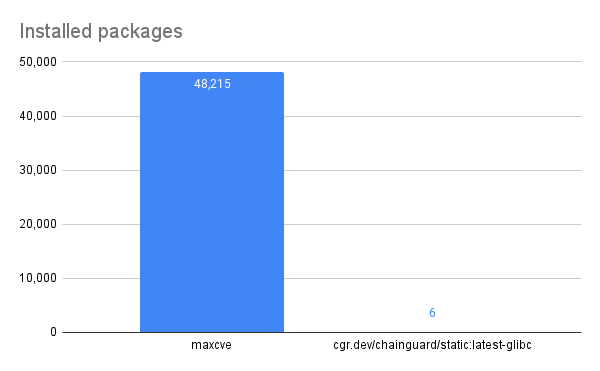

# _MAXIMUM CVEs_

[](https://github.com/imjasonh/maxcve/actions/workflows/release.yaml)

This repo generates a container image that maximizes the number of CVEs in the image, while minimizing the size of the image.

The result is a 148 KB image that reports as having almost _30,000 CVEs_. That's roughly one CVE for every 5 bytes of image data!

```
$ grype ghcr.io/imjasonh/maxcve/maxcve
...
 ✔ Vulnerability DB                [no update available]
 ✔ Cataloged packages              [26573 packages]
 ✔ Scanned for vulnerabilities     [29345 vulnerability matches]
   ├── by severity: 1925 critical, 17158 high, 8845 medium, 400 low, 0 negligible (1017 unknown)
   └── by status:   24759 fixed, 4586 not-fixed, 0 ignored
```

Or, if you prefer to consume data visually:


_Zero negligible vulns, nice!_



_Real minimal base image for scale_

### Development

```
go run . ttl.sh/maxcve
```

### How it works

To minimize size, the image doesn't actually contain any packages. In fact, it only contains two files:

1. `/etc/os-release`, which tells scanners the image is a [Wolfi](https://wolfi.dev) image.
1. `/lib/apk/db/installed`, which tells scanners that the image contains every version of every package that Wolfi has available.

Wolfi aims to reduce the number of vulnerable packages by producing new fixed packages as soon as possible. But, along the way, it also produces lots and _lots_ of packages that _do_ contain vulnerabilities. This image claims to contain all of them.

Amusingly, it takes about 500ms to build and push the image, and almost two minutes to scan it.

### Why?

Aside from being fun, this image demonstrates how scanners work -- and importantly, how they _don't_ work.

At their most basic, scanners require images (1) tell them what OS they are, and (2) tell them what packages they contain. This image does both, but it does so in a way that is misleading.

For a similar (but opposite) demonstration of this, see [Malicious Compliance: Reflections on Trusting Container Scanners](https://www.youtube.com/watch?v=9weGi0csBZM). In that talk, they mislead the scanner into finding fewer CVEs in the presence of vulnerable packages. In this demonstration, we mislead the scanner into finding vulnerabilities without installing any packages.
